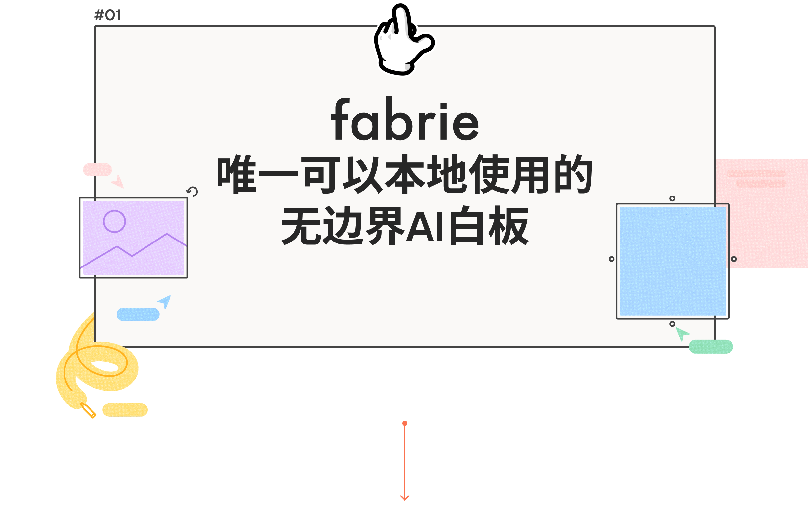
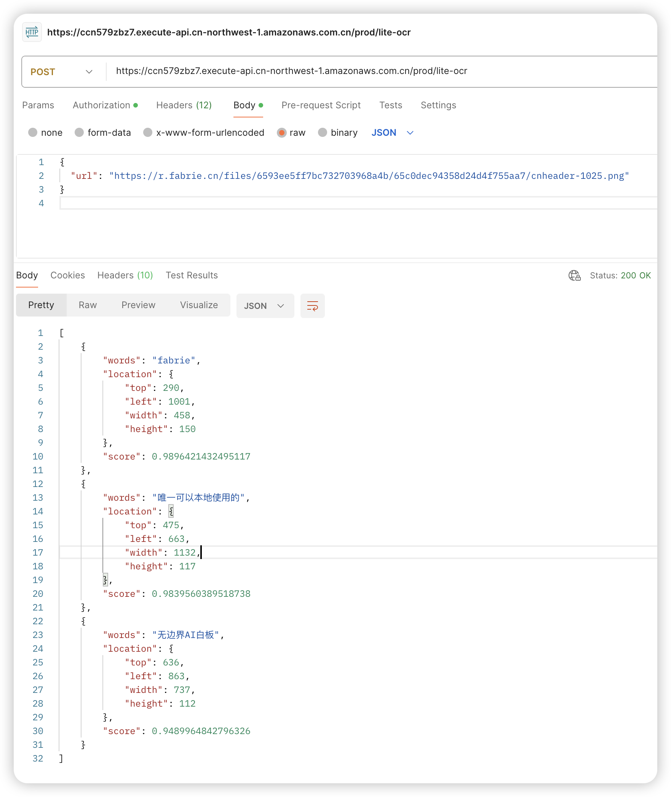
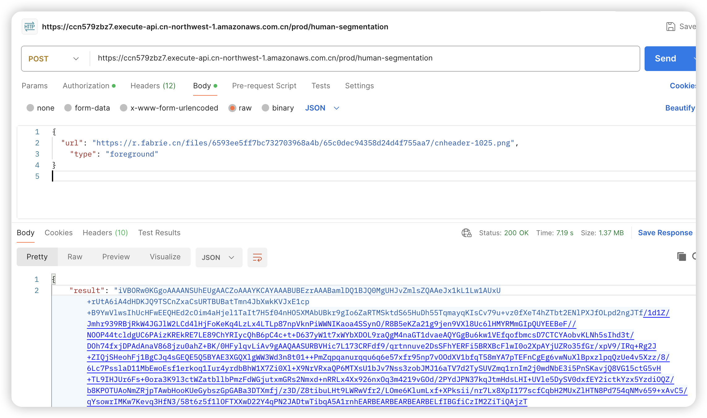
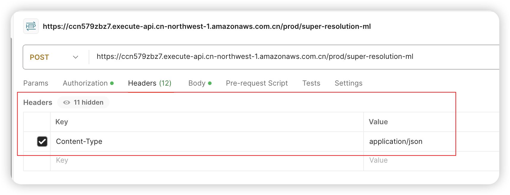
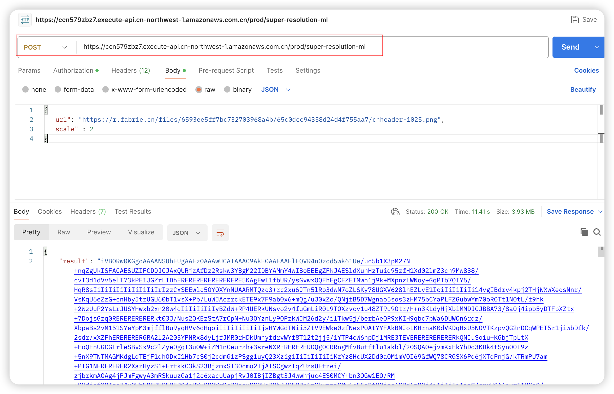
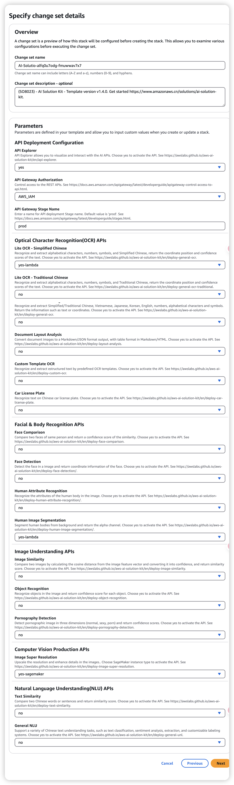
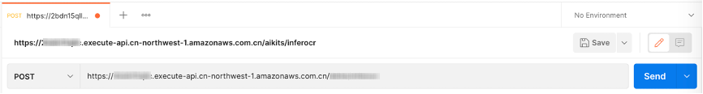

# 使用AWS打包服务AI Solution Kit满足常见的三个AI图形需求


## 一、需求和背景：

背景：

1. 客户在AWS ZHY区域部署了新的画板系统
2. 原系统使用阿里云API，现计划/需要迁移到AWS服务
3. 要求API必须在VPC内调用，内网访问 - 保证数据安全性！
4. VPC目前为AWS ZHY区域

具体功能需求：

1. OCR文字识别
2. 图片抠图（去背景）
3. 图片分辨率增强（2K/4K）

项目实施策略：

1. 先进行POC验证，确认API功能满足度
2. 若能够满足则试用，不满足另寻他法
3. 关键要点（内网访问保证数据安全）：

- 服务必须支持VPC内部署
- 在AWS ZHY区域可用
- 功能满足基本需求即可
- 需要快速验证可行性

需要评估AWS在ZHY区域可用的相关服务，并确认是否能满足这些API需求。


## 二、AI Solution Kit  开源方案满足需求（AWS打包提供）

AI Solution Kit 提供一系列基于深度学习的云上机器学习功能，例如文字识别、自然语言理解、人脸检测、图像理解等。您可以通过调用 API，轻松使用开箱即用的 AI 功能，同时与亚马逊云科技提供的其它服务无缝集成。

详情参考：

- https://awslabs.github.io/aws-ai-solution-kit/zh/

- https://github.com/awslabs/aws-ai-solution-kit

- https://github.com/awslabs/aws-ai-solution-kit/blob/main/README_zh-Hans.md 【中文】

  


具体功能需求分别对应AWS方案为（内有完整的API调用说明，请阅读）：

**1、OCR文字识别**

https://awslabs.github.io/aws-ai-solution-kit/zh/deploy-general-ocr/

**轻量级文字识别（简体中文）**：通用场景文字提取，通过返回在图片中文字内容与坐标位置等信息，便于客户进行比对或结构化操作。支持识别简体中文、英文、数字和常用符号。

适用场景 可应用于纸质文档电子化，证件识别，内容审核等多种场景，大幅提高信息处理效率。


**2、 图片抠图（去背景）**

https://awslabs.github.io/aws-ai-solution-kit/zh/deploy-human-image-segmentation/

**智能人像分割：**基于AI深度学习框架识别图像中的人体轮廓，实现高精度分割，使之与背景进行分离。

适用场景：可应用于照片背景替换、后期处理、证件照制作，人像抠图美化、背景虚化等多种场景。


**3、 图片分辨率增强（2K/4K）** 

https://awslabs.github.io/aws-ai-solution-kit/zh/deploy-image-super-resolution/

**图像超分辨率：**可将图片智能放大2或4倍，从而获取清晰度更高、细节丰富的图像。

适用场景：可应用于等多种场景，解决原始图片分辨率不足的问题。


**4、完整的 API 参考手册**

请参考 [API 参考手册](https://awslabs.github.io/aws-ai-solution-kit/zh/api-explorer/)


## 三、真实效果演示（请确认是否满足需求）


### **1、OCR文字识别**

1）识别图片：https://r.fabrie.cn/files/6593ee5ff7bc732703968a4b/65c0dec94358d24d4f755aa7/cnheader-1025.png



2）通过postman调用API：



3）结果

```json
[
    {
        "words": "fabrie",
        "location": {
            "top": 290,
            "left": 1001,
            "width": 458,
            "height": 150
        },
        "score": 0.9896421432495117
    },
    {
        "words": "唯一可以本地使用的",
        "location": {
            "top": 475,
            "left": 663,
            "width": 1132,
            "height": 117
        },
        "score": 0.9839560389518738
    },
    {
        "words": "无边界AI白板",
        "location": {
            "top": 636,
            "left": 863,
            "width": 737,
            "height": 112
        },
        "score": 0.9489964842796326
    }
]
```


### **2、 图片抠图（去背景）**

1）识别图片：https://r.fabrie.cn/files/6593ee5ff7bc732703968a4b/65c0dec94358d24d4f755aa7/cnheader-1025.png

2）通过postman调用API：



3）结果（使用https://base64.guru/converter/decode/image 进行解码base64到图片文件）

.png)


### **3、 图片分辨率增强（2K/4K）** 

1）识别图片：https://r.fabrie.cn/files/6593ee5ff7bc732703968a4b/65c0dec94358d24d4f755aa7/cnheader-1025.png

2）通过postman调用API：






3）结果（使用https://base64.guru/converter/decode/image 进行解码base64到图片文件）

222.png)

File Info

• Resolution: 4916×3092

• MIME type: image/png
• Extension: png
• Size: 2.95 MB
• Bit depth: 8


## 三、环境搭建关键点指南


**1）！务必通过github的入口运行cloudformation脚本，测试通过--- AWS宁夏区域好用！**https://github.com/awslabs/aws-ai-solution-kit


**2）Below is the quick links to launch the AWS CloudFormation template into your AWS account**

| Region name                                               | Region code        | Launch                                                       |
| --------------------------------------------------------- | ------------------ | ------------------------------------------------------------ |
| Global regions(switch to above region you want to deploy) | us-east-1(default) | [Launch](https://console.aws.amazon.com/cloudformation/home?region=us-east-1#/stacks/create/template?stackName=AI-Solution-Kit&templateURL=https://aws-gcr-solutions.s3.amazonaws.com/Aws-gcr-ai-solution-kit/v1.4.0/AI-Solution-Kit.template) |
| AWS China(Beijing) Region                                 | cn-north-1         | [Launch](https://cn-north-1.console.amazonaws.cn/cloudformation/home?region=cn-north-1#/stacks/create/template?stackName=AI-Solution-Kit&templateURL=https://aws-gcr-solutions.s3.cn-north-1.amazonaws.com.cn/Aws-gcr-ai-solution-kit/v1.4.0/AI-Solution-Kit.template) |
| **AWS China(Ningxia) Region**                             | **cn-northwest-1** | [Launch](https://cn-northwest-1.console.amazonaws.cn/cloudformation/home?region=cn-northwest-1#/stacks/create/template?stackName=AI-Solution-Kit&templateURL=https://aws-gcr-solutions.s3.cn-north-1.amazonaws.com.cn/Aws-gcr-ai-solution-kit/v1.4.0/AI-Solution-Kit.template) |

Once the AWS CloudFormation template is opened in your AWS account, you can choose the deep learning features in the **Parameters** section, the step-by-step instruction is available at: https://awslabs.github.io/aws-ai-solution-kit/zh/


**3）功能需求：1. OCR文字识别 2. 图片抠图（去背景） 3. 图片分辨率增强（2K/4K） 的配置如下：**




**4）部署成功后，第一次调用API，请注意postman需要配置AWS AK/SK通过鉴权后才能正常使用：**

<u>Postman（*AWS_IAM*认证）</u>

1. 访问[AWS CloudFormation](https://console.aws.amazon.com/cloudformation/)控制台。

2. 从堆栈列表中选择方案的根堆栈。

3. 打开**输出**标签页，找到以 **GeneralOCR** 为前缀的URL。

4. 在Postman中新建标签页，并把URL粘贴到地址栏，选择*POST*作为HTTP调用方法。

   

5. 打开Authorization配置，在下拉列表里选择Amazon Web Service Signature，并填写对应账户的AccessKey、SecretKey和Amazon Web Service Region（例如，cn-north-1或cn-northwest-1）。

   

6. 成功；

   

**5）AK/SK的最小权限配置，请参考 这里 https://awslabs.github.io/aws-ai-solution-kit/zh/faq/**

<u>使用解决方案都需要哪些AWS Identity and Access Management (IAM)权限？</u>

您在部署解决方案之后，可以通过Amazon API Gateway调用API，需要的权限如下。其中**sagemaker:**仅限于**图像超分辨率**API。

| Actions                               |
| :------------------------------------ |
| apigateway:DELETE                     |
| apigateway:GET                        |
| apigateway:PATCH                      |
| apigateway:POST                       |
| apigateway:PUT                        |
| cloudformation:CancelUpdateStack      |
| cloudformation:ContinueUpdateRollback |
| cloudformation:CreateChangeSet        |
| cloudformation:CreateStack            |
| cloudformation:DeleteStack            |
| cloudformation:DescribeChangeSet      |
| cloudformation:DescribeStackEvents    |
| cloudformation:DescribeStackResources |
| cloudformation:DescribeStacks         |
| cloudformation:GetStackPolicy         |
| cloudformation:GetTemplateSummary     |
| cloudformation:ListChangeSets         |
| cloudformation:ListStackResources     |
| cloudformation:ListStacks             |
| cloudformation:RollbackStack          |
| cloudformation:UpdateStack            |
| cloudformation:UpdateStackSet         |
| ecr:BatchCheckLayerAvailability       |
| ecr:BatchDeleteImage                  |
| ecr:BatchGetImage                     |
| ecr:CreateRepository                  |
| ecr:DeleteRepository                  |
| ecr:DescribeRepositories              |
| ecr:GetDownloadUrlForLayer            |
| ecr:GetRepositoryPolicy               |
| ecr:InitiateLayerUpload               |
| ecr:PutImage                          |
| ecr:SetRepositoryPolicy               |
| iam:AttachRolePolicy                  |
| iam:CreateRole                        |
| iam:DeleteRole                        |
| iam:DeleteRolePolicy                  |
| iam:DetachRolePolicy                  |
| iam:GetRole                           |
| iam:ListRoles                         |
| iam:PassRole                          |
| iam:PutRolePolicy                     |
| lambda:AddPermission                  |
| lambda:CreateFunction                 |
| lambda:DeleteFunction                 |
| lambda:GetFunction                    |
| lambda:InvokeFunction                 |
| lambda:RemovePermission               |
| lambda:UpdateFunctionConfiguration    |
| s3:GetObject                          |
| sagemaker:CreateEndpoint              |
| sagemaker:CreateEndpointConfig        |
| sagemaker:CreateModel                 |
| sagemaker:DeleteEndpoint              |
| sagemaker:DeleteEndpointConfig        |
| sagemaker:DeleteModel                 |
| sagemaker:DescribeEndpoint            |
| sagemaker:DescribeEndpointConfig      |
| sagemaker:DescribeModel               |
| sagemaker:InvokeEndpoint              |
| sns:ListTopics                        |


## 四、结束

## 

